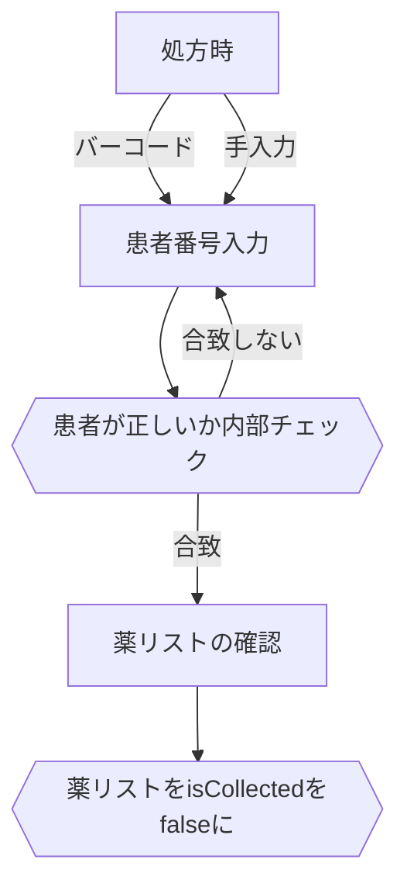
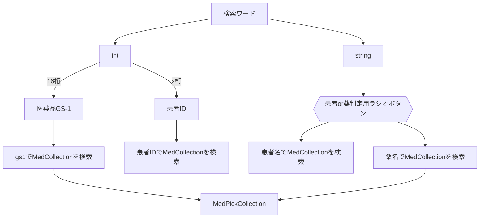
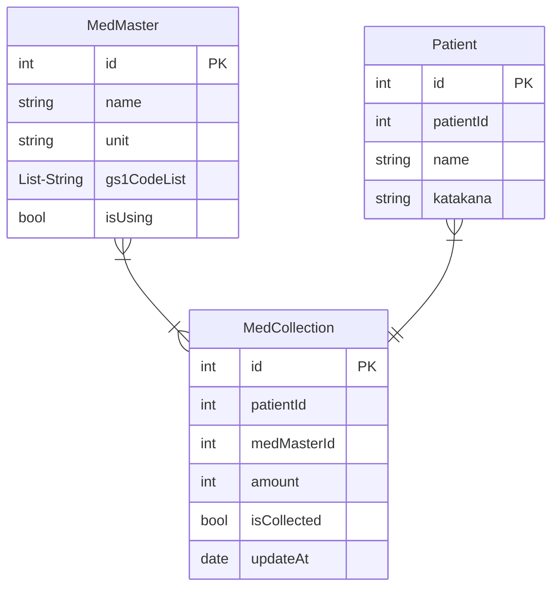

# ODP

## 実装戦略
- ミスゼロ子の親機に導入する
  - バーコードリーダーがデフォルトで使用できるため、これを入力インターフェースとして使用する。
- 実装はFlutterにて行う。（Flutter Winddows Desktop）
- キーボードを使用するのが難しいので、タッチ操作可能なUIを実装する
- また、画面サイズが非常に小さいので、それに対応したUIを実装する

## 実装要件
### 集薬時
‐ 患者番号が手入力できる
- 患者番号をバーコード入力できる
- 患者番号の存在チェックができる
- 患者番号が存在しないとき、患者登録できる
- 登録時に薬リストの確認ができる
- 登録時に薬リストを編集できる
- 登録完了できる
### 処方時
‐ 患者番号が手入力できる
- 患者番号をバーコード入力できる
- 患者番号からMedCollectionsを取り出して一覧表示できる
- 取り出したMedCollectionsのisCollectedを一括で変更できる
### 棚卸時
- 一括でMedCollectionsをisCollcter = Falseにできる
### 新商品採用のとき
- データベースを一括更新できる
- 手作業で薬マスタの追加ができる
- 既存のGS-1, 名称との重複チェックができる
- 上記重複がない場合に登録してよいか確認ダイアログが表示できる
- 薬マスタ登録ができる
### 名称変更のとき
- 変更前の医薬品を名称で検索できる
- 名称変更をフォームで入力できる
- 名称変更を実行していいか確認する
- 名称変更を完了できる

## UI設計
Figmaにて
https://www.figma.com/file/F7D6iuZsaUs7S1mYJKJRGp/ODP%E5%9C%A8%E5%BA%AB%E7%AE%A1%E7%90%86%E3%82%A2%E3%83%97%E3%83%AA?node-id=0%3A1&t=3qeMwRsSepiNHmRF-0

## フローチャート
### 処方時
処方が出た後に、ODPリストから薬を削除する目的で行うフロー

### 検索ワード判定フロー

 - ^[\u4E00-\u9FFF]+$
   - 👆 で漢字のみを抽出できるが、名前と医薬品の判定は不可能と判断
   - カタカナ含む患者名と、漢方を区別できないため。

### 一括処理
 - 一括でisCollectをfalseにする
 - 一括でバーコードを印刷する
 - 一括で更新されていない患者を削除する

### Entity

**Patient（id）**　→ MedCollection(patientId)であり、**Patient（patientId)はリレーションに使用しない。**

### 備忘録
当初、店舗内ネットワークでAPIサーバーを公開し、店舗内のすべてのPCでシステムを利用したいと考えていた。  
APIサーバーをデプロイするPCのスペックは低かった為、なるべくメモリ使用量が少なく、レスポンスも早いものが良かったのでRust製APIを作成しようと試みた。  
しかし、バーコードリーダーはサーバー機くらいしか配備されておらず、患者登録の手間と天秤にかけた時、店舗内PCすべてで利用する価値よりもバーコードリーダーの利用価値の方が高いと判断した。  
したがって、APIサーバーの実装は不要と決定。  
プロジェクト内にRust製APIの初期実装が残っているのはその名残。
