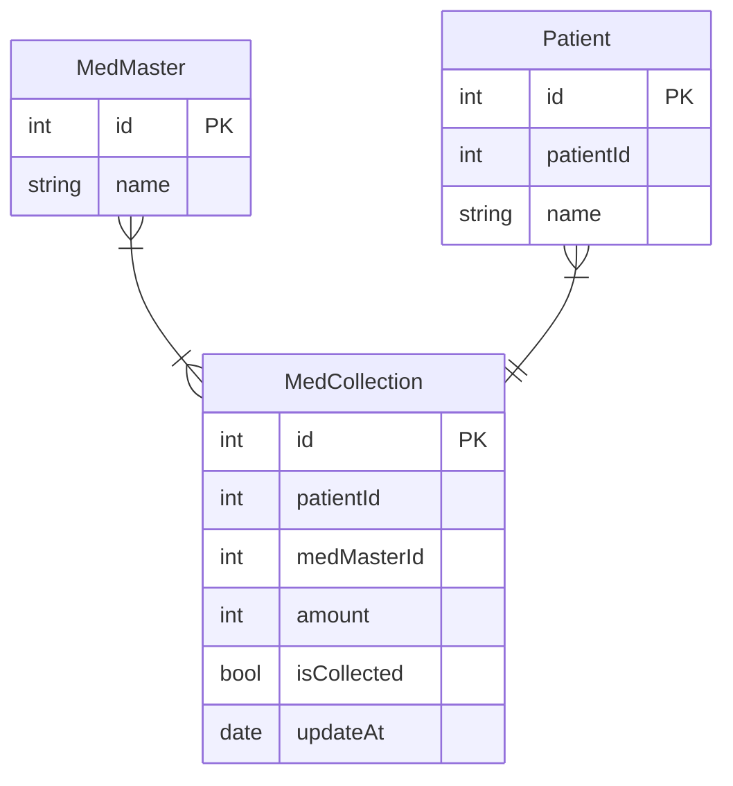

# ODP

## 実装戦略
- ミスゼロ子の親機に導入する
  - バーコードリーダーがデフォルトで使用できるため、これを入力インターフェースとして使用する。
- 実装はFlutterにて行う。（Flutter Winddows Desktop）
- キーボードを使用するのが難しいので、タッチ操作可能なUIを実装する
- また、画面サイズが非常に小さいので、それに対応したUIを実装する

### Entity

**Patient（id）**　→ MedCollection(patientId)であり、**Patient（patientId)はリレーションに使用しない。**
