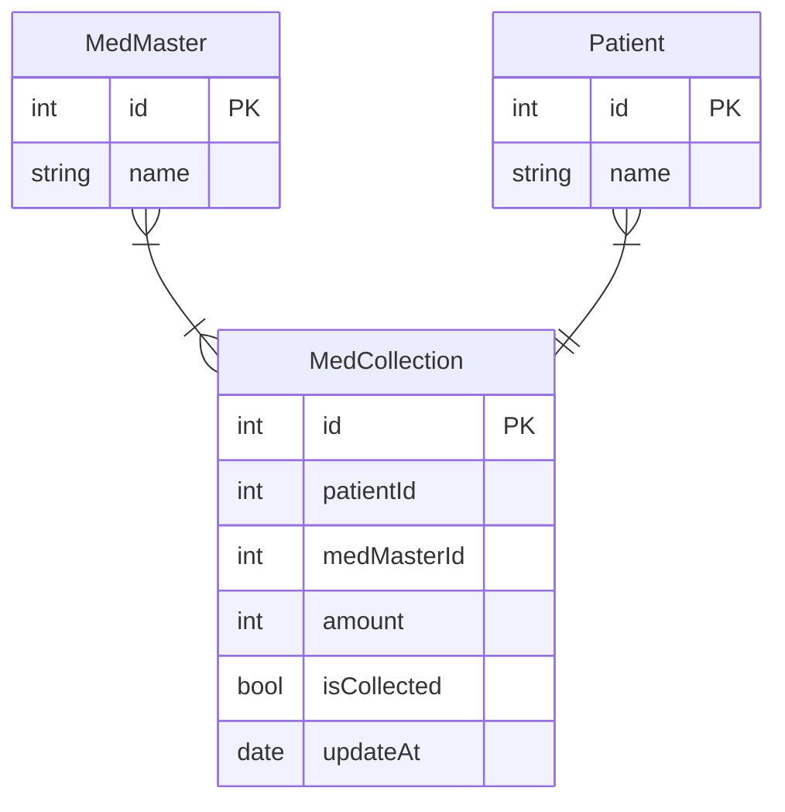

# ODP

### Entity

```mermaid
erDiagram

MedMaster }|--|{ MedCollection : ""
Patient }|--|| MedCollection : ""

    Patient {
        int id PK
        string name
    }

    MedCollection {
        int id PK
        int patientId
        int medMasterId
        int amount
        bool isCollected
        date updateAt
    }

    MedMaster {
        int id PK
        string name
    }

```