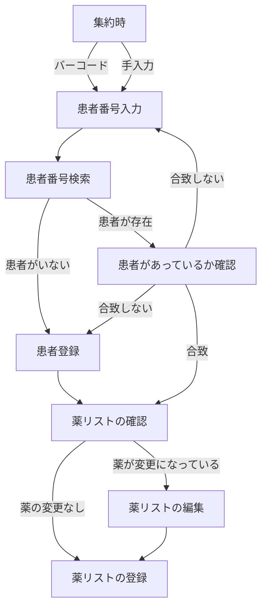
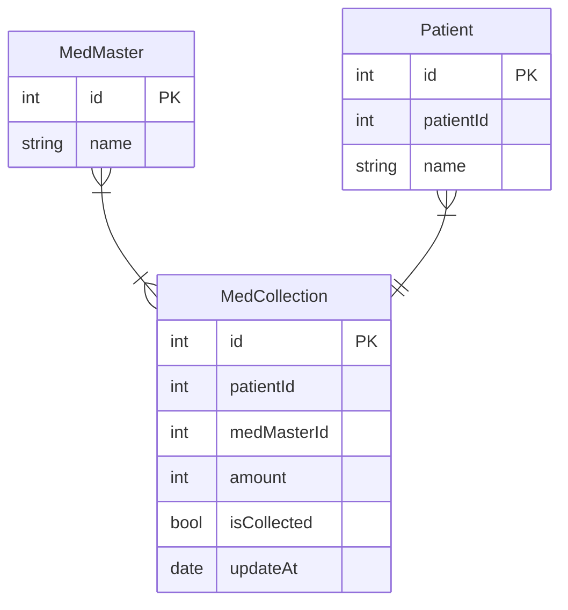

# ODP

## 実装戦略
- ミスゼロ子の親機に導入する
  - バーコードリーダーがデフォルトで使用できるため、これを入力インターフェースとして使用する。
- 実装はFlutterにて行う。（Flutter Winddows Desktop）
- キーボードを使用するのが難しいので、タッチ操作可能なUIを実装する
- また、画面サイズが非常に小さいので、それに対応したUIを実装する

## フローチャート
### 集薬
集薬が終わった時に、ODPリストに薬を登録する目的で行うフロー。
‐ 患者番号が手入力できる
- 患者番号をバーコード入力できる
- 患者番号が存在しないとき、患者登録できる
- 登録時に薬リストの確認ができる
- 登録時に薬リストを編集できる
- 登録完了できる

### Entity

**Patient（id）**　→ MedCollection(patientId)であり、**Patient（patientId)はリレーションに使用しない。**
