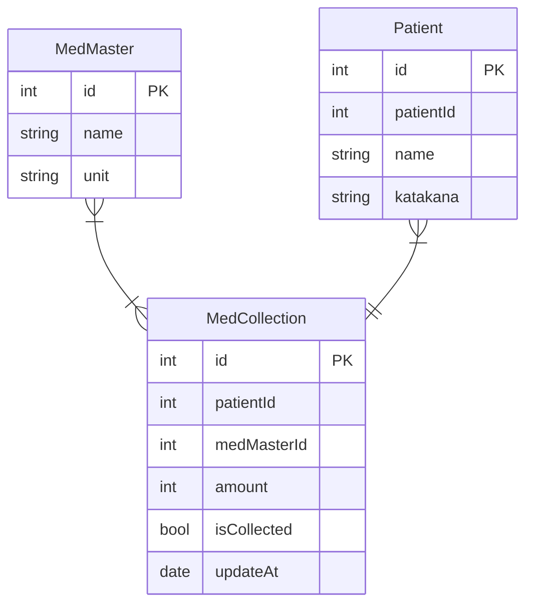

# ODP

## 実装戦略
- ミスゼロ子の親機に導入する
  - バーコードリーダーがデフォルトで使用できるため、これを入力インターフェースとして使用する。
- 実装はFlutterにて行う。（Flutter Winddows Desktop）
- キーボードを使用するのが難しいので、タッチ操作可能なUIを実装する
- また、画面サイズが非常に小さいので、それに対応したUIを実装する

## フローチャート
### 集薬時
集薬が終わった時に、ODPリストに薬を登録する目的で行うフロー。
‐ 患者番号が手入力できる
- 患者番号をバーコード入力できる
- 患者番号が存在しないとき、患者登録できる
- 登録時に薬リストの確認ができる
- 登録時に薬リストを編集できる
- 登録完了できる

### 処方時
処方が出た後に、ODPリストから薬を削除する目的で行うフロー

### 検索時
 - 患者ID or 患者名 → 患者の薬リストを提供する  
 - 薬品名 → 集薬している量と、患者リストを提供する

### 一括処理
 - 一括でisCollectをfalseにする
 - 一括でバーコードを印刷する
 - 一括で更新されていない患者を削除する
 

### マスタ編集
患者マスタ、薬マスタを編集する

### Entity

**Patient（id）**　→ MedCollection(patientId)であり、**Patient（patientId)はリレーションに使用しない。**
